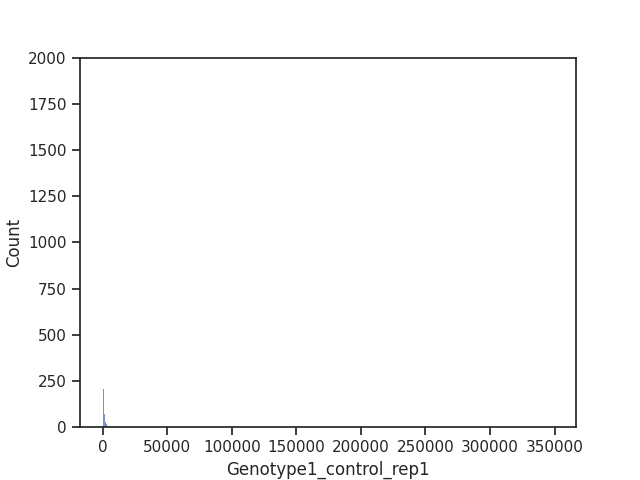
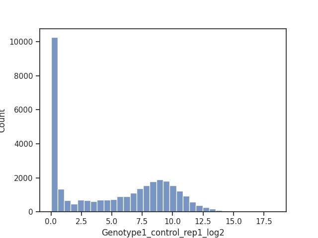
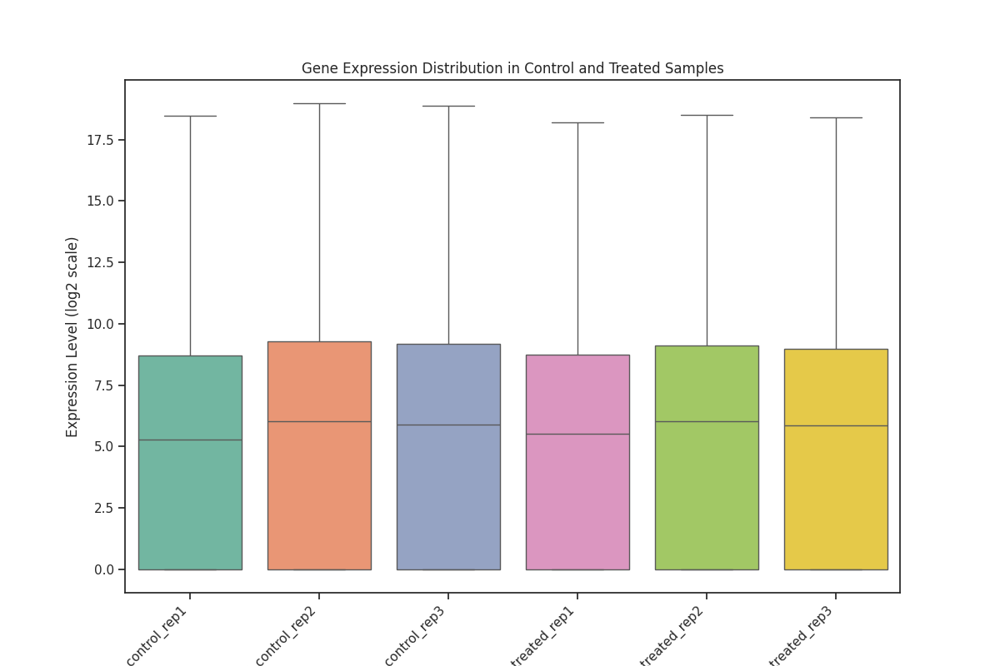
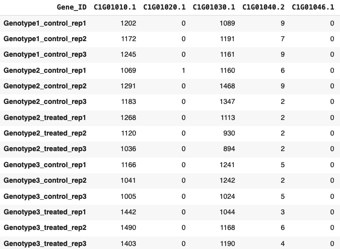
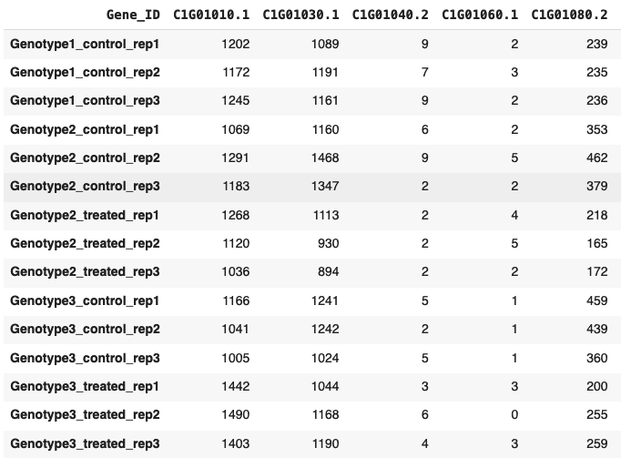

# Gene-Expression-Analysis-Project
## [Project Code](https://colab.research.google.com/drive/1H5h8SE81VHLBebmaN5ZppS3MgYLbXnhS?usp=sharing)
## [Project Report](https://docs.google.com/document/d/1Z-6b-gMOwuYj3z23w6n1fa7wI4TbhQczHt4jumNr7ws/edit?usp=sharing)

# Exploratory Data Analysis
## Raw data distribution
Raw Counts |	Log2 Transformed Counts
-|-
 | 
## Control vs Treated replicates boxplot

# Data Filtration
We filter out genes that have less than 10 read counts in total
Before filtration |	After filtration
-|-
 | 

As a result of this filtration the **number of genes came down from 33602 to 24303**
